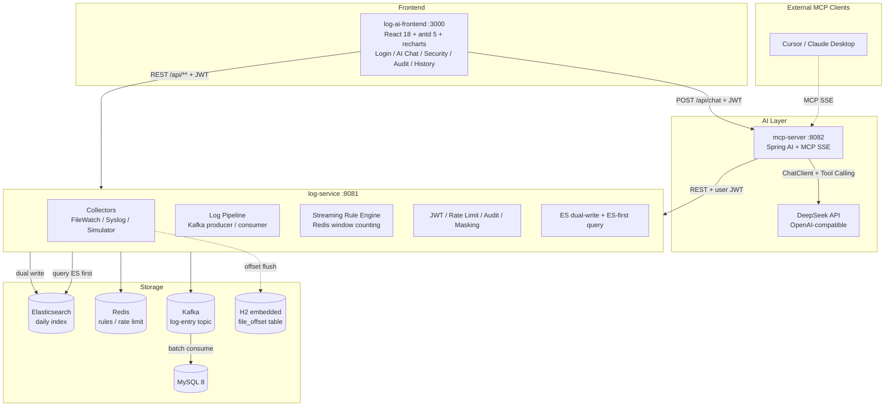

# Log Monitor AI Platform

[中文](README.md) | [English](README.en.md)


An **AI-driven log analysis Agent platform built on the MCP protocol**. It turns log search, distributed tracing, exception clustering, and root-cause analysis into AI-callable tools, and ships with a production-oriented pipeline: file/Syslog collection, Kafka decoupling, MySQL + Elasticsearch dual storage, a streaming security rule engine, JWT authentication, audit logging, and health checks.

Talk to your logs in natural language: *"find the latest ERROR logs"*, *"trace the request with traceId=trace-001"*, or *"cluster the recent exceptions"*. The AI selects the right tool, queries the backend, and returns visualized, structured results.

## Highlights

- **MCP Server out of the box** — exposes 6 `@Tool`s over SSE; connect Cursor, Claude Desktop, or any MCP client.
- **Natural language log analysis** — DeepSeek + Spring AI ChatClient with tool calling and streaming (SSE) responses.
- **Multi-source collection** — FILE (WatchService + RandomAccessFile), SYSLOG/CEF (UDP 5140), HTTP, ELK, LOKI, and MOCK.
- **Production log pipeline** — Kafka for decoupling and buffering, at-least-once delivery, H2-persisted file offsets, batch writes to MySQL.
- **MySQL + Elasticsearch dual storage** — ES-first queries with automatic MySQL fallback; daily indices; idempotent backfill for existing data.
- **Streaming rule engine** — Redis-backed MATCH (SETNX dedup) and THRESHOLD (ZSET time-window counting) rules with a preset security rule set.
- **Security** — JWT login, Redis rate limiting, audit logging (AOP), AES-GCM config encryption, sensitive data masking.
- **Unified identity** — the frontend JWT is passed through to every AI-triggered query, so audit logs record the real user instead of the service account.
- **K8s-ready** — Actuator readiness/liveness probes (db/redis/kafka/es).

## Screenshots

**Login Page** — JWT authentication with multi-user isolation.


## Architecture



## Security Dashboard

Real-time SOC view powered by the rule engine and AI anomaly detection: alert statistics, alert list, top attacking IPs, and 24-hour alert trend.


**Core Modules**:

- Alert stats cards: total / pending / critical / resolved
- Alert list: severity / rule / source IP / content / status / actions
- Top attack source IPs: Top 10
- 24h alert trend: time-series chart with 30s auto-refresh
- Status workflow: acknowledge / resolve / one-click actions

**Underlying Capabilities**:

- Rule engine: THRESHOLD + MATCH dual modes
- AI security analysis: `detectAnomalies` (high-frequency IPs / SQL injection / XSS / brute force)
- Attack chain reconstruction: `correlateEvents` (correlate multi-step behaviors by source IP)

## AI Chat Interface

Natural language log queries with light/dark theme support.


**Core Features**:

- Natural language queries (Chinese / English)
- 4 quick action buttons (ERROR search / exception clustering / TraceID lookup / root-cause)
- Markdown rendering with tool-block visualization (TraceTimeline / ClusterChart)
- SSE streaming response with word-by-word display
- User-isolated chat history persistence

**Tool Calling Showcase**

A user asks *"cluster the recent exceptions"* in natural language. The AI auto-calls the `clusterExceptions` tool and returns a structured report:


The report contains:

- Statistical overview (6 exception types, 50+ logs, WAF service source)
- A ranking table grouped by exception type (SQL Injection / XSS / attack categories)
- Attack category summary (SQL Injection 29 / 58%, XSS 21 / 42%)
- Conclusive analysis (attack surface in the WAF layer, SQLi as the main direction, recon-then-exploit pattern)
- Follow-up analysis suggestions (correlation / anomaly detection / detailed logs)

**Security Audit Log**

Auto-records all sensitive operations via the `@AuditLog` annotation and AOP aspect, with multi-dimensional filtering (operation type, user, result, IP).


**Core Features**:

- Auto-recording: login, AI chat, log queries and other sensitive operations
- Sensitive data masking: password fields shown as `******` in audit logs
- Multi-dimensional filtering: operation type / username / time range
- Source IP tracking: locate operation origin
- Failure reason: record failure causes

**Implementation**:

- Aspect: [AuditLogAspect.java](log-service/src/main/java/com/logmonitor/log/audit/AuditLogAspect.java)
- Annotation: `@AuditLog(operation = "AI_CHAT_STREAM", sensitive = true)`
- Persistence: MySQL `audit_log` table

## Tech Stack

| Layer | Tech | Version |
|---|---|---|
| Framework | Spring Boot | 3.3.6 |
| AI framework | Spring AI | 1.0.0 GA |
| MCP protocol | spring-ai-starter-mcp-server-webmvc | 1.0.0 |
| LLM | DeepSeek (OpenAI-compatible) | deepseek-v4-flash |
| ORM | MyBatis-Plus | 3.5.10 |
| Database | MySQL | 8.x |
| Message queue | Apache Kafka | 3.7.x |
| Cache | Redis | 7.x |
| Search engine | Elasticsearch | 8.9.x |
| Auth | JWT (jjwt 0.12.5) + Spring Security Crypto | - |
| Health checks | Spring Boot Actuator | 3.3.6 |
| JSON | FastJSON2 | 2.0.43 |
| JDK | OpenJDK | 17+ |
| Build | Maven | 3.8+ |
| Frontend | React + TypeScript | 18 + 5.6 |
| UI kit | antd | 5.22 |
| Charts | recharts | 2.13 |
| Frontend build | Vite | 6.0 |

## Quick Start

### Prerequisites

- JDK 17+, Maven 3.8+
- MySQL 8+
- Kafka 3.x, Redis 7.x, Elasticsearch 8.9.x (can run on separate servers)
- Node.js 18+ (frontend)
- A DeepSeek API key

### 1. Initialize the database

```bash
mysql -u root -p -e "CREATE DATABASE log_monitor DEFAULT CHARSET utf8mb4;"
mysql -u root -p log_monitor < .docs/sql/logs.sql
mysql -u root -p log_monitor < .docs/sql/log_entry_indexes.sql
mysql -u root -p log_monitor < .docs/sql/sa_schema.sql
```

### 2. Start log-service (:8081)

```bash
mvn install -DskipTests        # install the common module first
java -jar log-service/target/log-service-1.0.0-SNAPSHOT.jar
```

### 3. Start mcp-server (:8082)

```bash
export DEEPSEEK_API_KEY=sk-your-real-key
java -jar mcp-server/target/mcp-server-1.0.0-SNAPSHOT.jar
```

### 4. Start the frontend (:3000)

```bash
cd log-ai-frontend
npm install
npm run dev
```

### 5. Access

- Frontend: http://localhost:3000 (default account: `admin / 123456`)
- log-service: http://localhost:8081
- MCP SSE endpoint: http://localhost:8082/sse
- Health check: http://localhost:8081/actuator/health

### Middleware addresses

Defaults point to a demo environment and can be overridden with environment variables:

```bash
export KAFKA_BOOTSTRAP_SERVERS=your-kafka:9092
export REDIS_HOST=your-redis
export ES_URIS=http://your-es:9200
export LOG_SERVICE_TOKEN=your-service-token
export JWT_SECRET=your-jwt-secret
```

## MCP Client Integration

Add this to your MCP client configuration (Cursor, Claude Desktop, etc.):

```json
{
  "mcpServers": {
    "log-analysis": {
      "url": "http://localhost:8082/sse"
    }
  }
}
```

### Built-in MCP Tools

| Tool | Description |
|---|---|
| `searchLogs` | Search logs by level, keyword, service, trace ID (paginated) |
| `getTraceLogs` | Fetch the full distributed trace by TraceID |
| `clusterExceptions` | Cluster exceptions by type and stack-trace head |
| `locateRootCause` | Locate the root cause along the exception propagation path |
| `detectAnomalies` | Detect security anomalies from recent logs (high-frequency IPs, port scans, SQLi/XSS, brute force) |
| `correlateEvents` | Correlate security events by source IP or time window |

## API Overview (log-service)

| Method | Path | Description |
|---|---|---|
| POST | `/api/auth/login` | Login, returns JWT |
| GET | `/api/auth/me` | Current user |
| GET | `/api/log/entries` | Paginated log search (ES first, multi-dimensional filters) |
| GET | `/api/log/entries/{id}` | Log detail |
| GET | `/api/log/trace/{traceId}` | Trace logs by TraceID |
| POST | `/api/log/collect` | Batch log ingestion over HTTP |
| GET | `/api/alert` | Alert list (status/severity filters) |
| GET | `/api/alert/stats` | Alert statistics + 24h trend |
| PUT | `/api/alert/{id}/ack` | Acknowledge alert |
| PUT | `/api/alert/{id}/resolve` | Resolve alert |
| GET/POST | `/api/rule` | List/create rules |
| PUT/DELETE | `/api/rule/{id}` | Update/delete rule |
| PUT | `/api/rule/{id}/toggle` | Enable/disable rule |
| GET | `/api/audit` | Paginated audit logs |
| GET | `/api/chat-history` | Current user's chat history |
| POST | `/api/chat-history/batch` | Save a conversation (attributed by user JWT) |
| POST | `/api/admin/es/backfill` | Backfill existing MySQL logs into ES (idempotent) |
| GET | `/actuator/health` | Health check (unauthenticated) |

## Project Structure

```text
log-ai/
├── pom.xml
├── .docs/                  # SQL scripts: schema, indexes, security rules
├── common/                 # Shared entities (LogEntry/Rule/Alert/AuditLog/ChatHistory)
├── log-service/            # Collection, pipeline, rules, security, ES, health (port 8081)
├── mcp-server/             # MCP Server + ChatClient + 6 tools (port 8082)
├── log-ai-frontend/        # React + TypeScript + antd 5 (port 3000)
└── README.md
```

## Testing

```bash
mvn test
```

87 unit tests covering authentication, rate limiting, audit, encryption/masking, Kafka pipeline, the streaming rule engine, ES read/write, health indicators, chat history, and identity propagation.

## Extending

- **Swap the LLM**: change the `spring.ai.openai` settings in mcp-server.
- **Add an MCP tool**: add a `@Tool` method in `LogAnalysisTools`.
- **Add a log source**: extend the `LogSource` enum and implement a collector.
- **Scale horizontally**: the Kafka consumer group scales naturally; replace the H2 file-offset store with shared storage for multi-instance deployments.
- **Production hardening**: inject the JWT secret, service token, and DeepSeek key via environment variables; add role-based access control for admin endpoints.

---

If you find this project helpful, give it a ⭐ — feedback and PRs are welcome!
