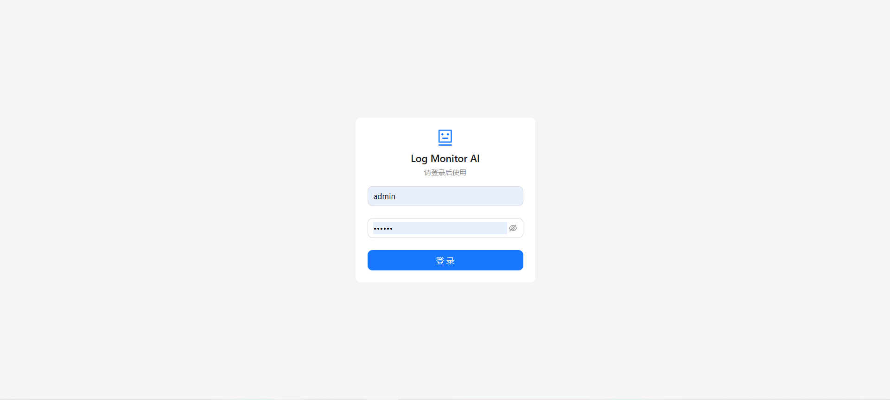
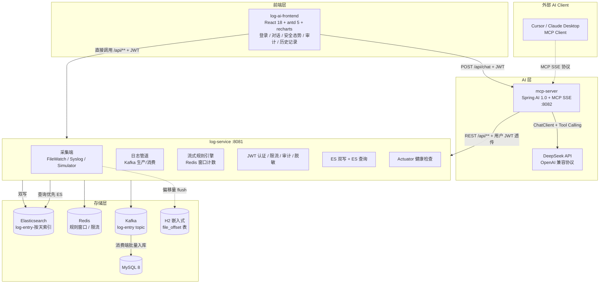
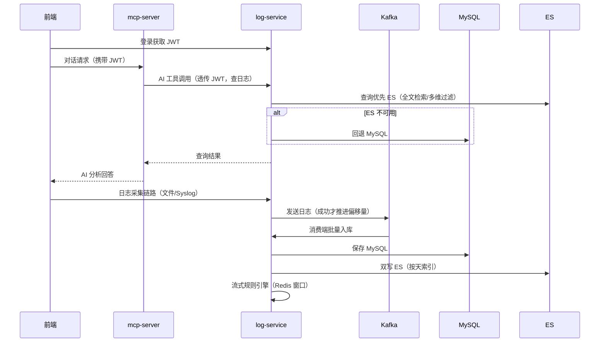
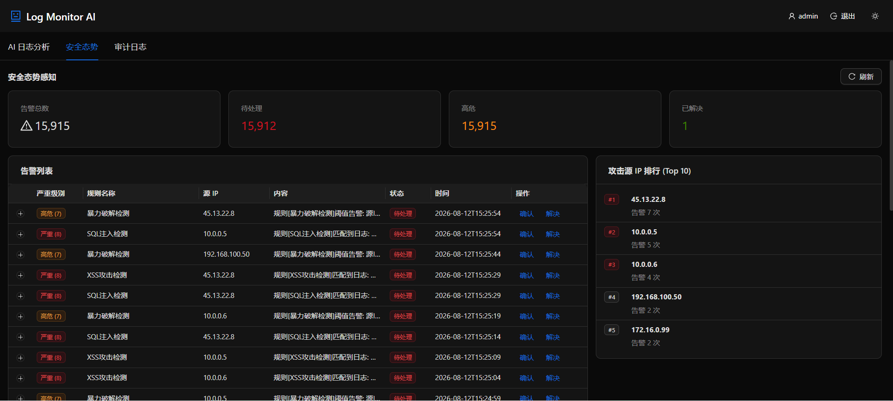
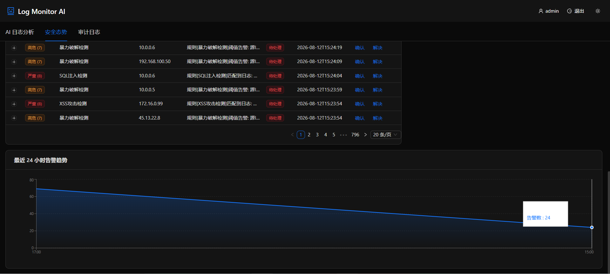
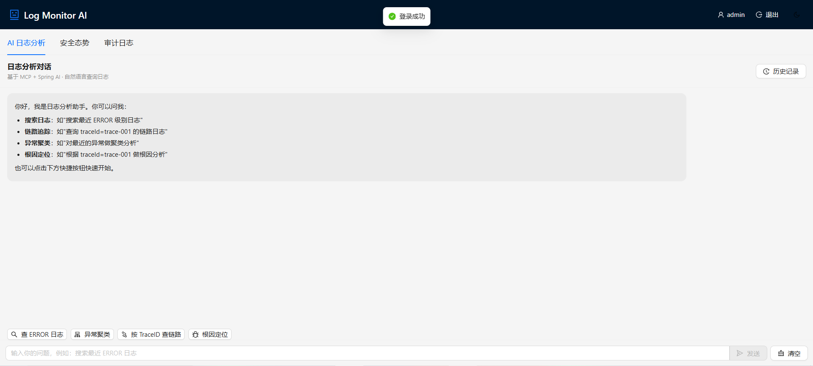
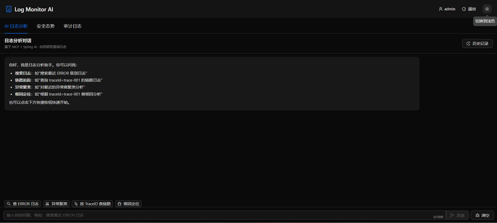
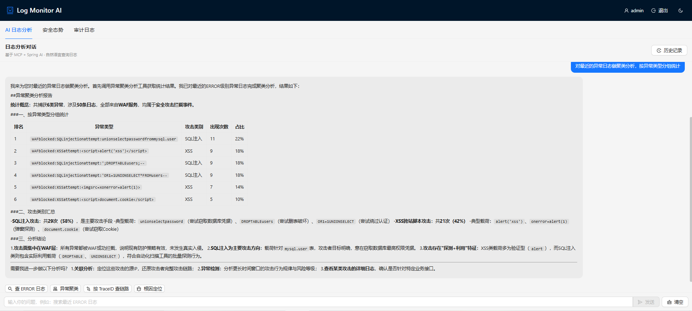
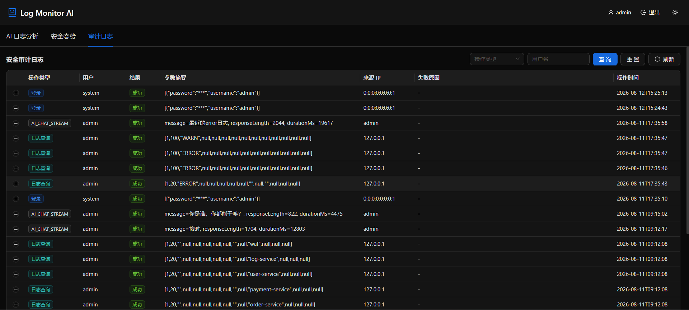

# Log Monitor AI Platform

[English](README.en.md) | [中文](README.md)


基于 MCP 协议的日志分析 Agent 平台。平台将日志检索、链路追踪、异常聚类、根因定位封装为 AI 可调用工具，支持自然语言对话式日志分析，并提供安全态势感知、生产级日志管道、ES 全文检索、认证审计、健康检查与对话历史持久化能力。

## 1. 核心能力

### 1.1 AI 日志分析

- 自然语言查询：用户用中文/英文描述问题，AI 自动选择合适的工具完成检索与分析
- 链路追踪：从日志内容正则提取 SkyWalking TraceID，按 TraceID 聚合链路日志
- 异常聚类：按异常类型 + 堆栈首行分组统计，快速识别高频异常
- 根因定位：基于链路日志识别异常传播路径，定位根本原因
- MCP 协议：日志分析能力通过 MCP Server 暴露，Cursor / Claude Desktop 等 AI 应用可作为 MCP Client 接入
- 可视化展示：TraceID 链路时间线、异常聚类柱状图、Markdown 渲染

### 1.2 系统截图

**登录页**：JWT 认证入口，支持多用户隔离。



### 1.3 安全态势感知

- Syslog 采集：UDP 5140 端口接收 Syslog / CEF 格式安全日志
- 流式规则引擎：日志入库后基于 Redis 实时判定规则，MATCH 规则幂等去重、THRESHOLD 规则时间窗口计数
- 告警管理：告警列表、状态流转（OPEN/ACK/RESOLVED）、统计聚合、攻击源 IP 排行、24 小时趋势
- AI 安全分析：detectAnomalies（异常行为检测）、correlateEvents（攻击链关联分析）
- 模拟日志生成器：自动生成模拟攻击日志，便于演示

### 1.4 平台能力

- Kafka 日志管道：采集端 → Kafka 削峰 → 消费端批量入库，发送成功才推进文件偏移量（at-least-once）
- 多源日志：FILE（文件监控）/ SYSLOG / CEF / HTTP / ELK / LOKI / MOCK
- ES 双写与查询：日志同时写入 MySQL 与 ES（按天索引），查询 ES 优先、MySQL 兜底，支持存量数据回填
- 认证与安全：JWT 登录、Redis 限流、审计日志、AES-GCM 配置加密、敏感信息脱敏
- 身份统一：前端 JWT 透传 mcp-server → log-service，AI 发起的查询按真实用户审计
- 对话历史持久化：同一用户的历史问答与查询记录可回看，数据按用户隔离
- 健康检查：Actuator 就绪/存活探针（DB/Redis/Kafka/ES），支持 K8s 直接接入

## 2. 架构

### 2.1 架构图



### 2.2 技术栈

| 层级 | 技术 | 版本 |
|---|---|---|
| 基础框架 | Spring Boot | 3.3.6 |
| AI 框架 | Spring AI | 1.0.0 GA |
| MCP 协议 | spring-ai-starter-mcp-server-webmvc | 1.0.0 |
| 大模型 | DeepSeek（OpenAI 兼容） | deepseek-v4-flash |
| ORM | MyBatis-Plus | 3.5.10 |
| 数据库 | MySQL | 8.x |
| 消息队列 | Apache Kafka | 3.7.x |
| 缓存 | Redis | 7.x |
| 搜索引擎 | Elasticsearch | 8.9.x |
| 认证 | JWT（jjwt 0.12.5）+ Spring Security Crypto | — |
| 健康检查 | Spring Boot Actuator | 3.3.6 |
| JSON | FastJSON2 | 2.0.43 |
| JDK | OpenJDK | 17+ |
| 构建工具 | Maven | 3.8+ |
| 前端框架 | React + TypeScript | 18 + 5.6 |
| UI 组件 | antd | 5.22 |
| 图表库 | recharts | 2.13 |
| 前端构建 | Vite | 6.0 |

### 2.3 数据流



### 2.4 安全态势大屏

基于规则引擎 + AI 异常检测的实时 SOC 视图：告警统计、告警列表、攻击源 IP 排行、24 小时告警趋势。




**核心模块**：

- 告警统计卡片：总数 / 待处理 / 高危 / 已解决
- 告警列表：严重级别 / 规则名称 / 源 IP / 内容 / 状态 / 操作
- 攻击源 IP 排行：Top 10 高频攻击源
- 24 小时告警趋势：时序折线图，30 秒自动刷新
- 状态流转：确认 / 解决 / 一键操作

**支撑能力**：

- 规则引擎：THRESHOLD（阈值）+ MATCH（匹配）双模式
- AI 安全分析：detectAnomalies 工具（高频 IP / SQL 注入 / XSS / 暴力破解）
- 攻击链还原：correlateEvents 工具（按源 IP 关联多步行为）

## 3. 模块说明

| 模块 | 说明 | 端口 |
|---|---|---|
| `common` | 公共实体（LogEntry/Rule/Alert/AuditLog/ChatHistory）、Result、异常 | — |
| `log-service` | 日志采集、Kafka 管道、规则引擎、认证/审计/加密、ES 读写、健康检查 | 8081 |
| `mcp-server` | MCP Server + ChatClient，暴露 6 个 @Tool、对话/历史接口 | 8082 |
| `log-ai-frontend` | 登录、AI 对话、安全态势、审计日志、历史记录 | 3000 |

### 3.1 common（公共模块）

| 包 | 内容 |
|---|---|
| `entity` | LogEntry（含安全字段）、Rule、Alert、AuditLog、ChatHistory |
| `enums` | LogLevel、LogSource（FILE/SYSLOG/CEF/HTTP/ELK/LOKI/MOCK） |
| `result` | Result&lt;T&gt; 统一返回体 |
| `exception` | BusinessException |

### 3.2 log-service — 端口 8081

**日志采集**

- `FileWatchService` 多目录监听，增量读取日志文件（WatchService + RandomAccessFile）
- 多格式自动适配（Json / Logback 自定义 / Logback 默认 / Log4j2 / Plain 兜底）
- TraceID 正则提取（兼容 SkyWalking TID、`traceId`、`tid` 等格式）
- 偏移量落盘 H2（`data/log-offset.mv.db`），重启不重复采集
- OOM 防护：单次 batch 上限、单次读取行数上限

**Kafka 日志管道**

- `log.pipeline.mode=kafka`：采集端 → Kafka → 消费端批量入库
- 同步发送 + 超时控制：发送成功才推进偏移量，Kafka 不可用时不丢日志
- 消费端手动 ack：入库成功才提交，失败自动重新投递（at-least-once）
- 降级模式：`log.pipeline.mode=direct` 直接批量入库（无 Kafka 环境）

**流式规则引擎（Redis）**

- `log.rule-engine.streaming.enabled=true` 时启用
- MATCH 规则：SETNX 幂等去重；THRESHOLD 规则：ZSET 时间窗口计数
- 规则缓存定时刷新（默认 30 秒）

**安全体系**

- JWT 登录（`/api/auth/login`），HS256，默认账号 `admin / 123456`
- Redis 限流（`@RateLimit` 注解）
- 审计日志（`@AuditLog` 注解）：登录、日志查询、告警处理、规则变更、AI 对话
- AES-GCM 配置加密：`ENC()` 前缀值启动时自动解密
- 敏感信息脱敏：password/token/手机号/身份证

**ES 双写与查询**

- 双写：日志入库 MySQL 后 bulk 写入 ES（按天索引 `log-entry-2026-08-08`），ES 故障不影响 MySQL
- 查询：`/api/log/entries`、`/api/log/trace/{traceId}` 查询 ES 优先，ES 异常自动回退 MySQL
- 索引模板：启动时自动创建 `log-entry-template`（logTime 为 date、精确字段 text+keyword）
- 存量回填：`POST /api/admin/es/backfill` 把 MySQL 历史日志幂等写入 ES

**健康检查（Actuator）**

- `/actuator/health`、`/actuator/health/readiness`（db/redis/kafka/es）、`/actuator/health/liveness`（ping）
- 自定义 EsHealthIndicator、KafkaHealthIndicator，健康状态跳变时输出日志

**REST API**

| 方法 | 路径 | 说明 |
|---|---|---|
| POST | `/api/auth/login` | 登录，返回 JWT |
| GET | `/api/auth/me` | 当前登录用户 |
| GET | `/api/log/entries` | 分页查询日志（ES 优先，支持多维度筛选） |
| GET | `/api/log/entries/{id}` | 查询单条日志详情 |
| GET | `/api/log/trace/{traceId}` | 按 TraceID 查询链路日志 |
| POST | `/api/log/collect` | HTTP 模式批量接收日志上报 |
| GET | `/api/alert` | 告警列表（分页/状态/级别筛选） |
| GET | `/api/alert/{id}` | 告警详情 |
| GET | `/api/alert/stats` | 告警统计（状态/级别/24h 趋势） |
| PUT | `/api/alert/{id}/ack` | 确认告警 |
| PUT | `/api/alert/{id}/resolve` | 解决告警 |
| GET/POST | `/api/rule` | 规则查询/创建 |
| PUT | `/api/rule/{id}` | 更新规则 |
| DELETE | `/api/rule/{id}` | 删除规则 |
| PUT | `/api/rule/{id}/toggle` | 启用/停用规则 |
| GET | `/api/audit` | 审计日志分页查询 |
| POST | `/api/audit` | 服务方上报审计（mcp-server） |
| GET | `/api/chat-history` | 当前用户对话历史（分页） |
| POST | `/api/chat-history/batch` | 保存一段对话（按用户 JWT 归属） |
| POST | `/api/admin/es/backfill` | ES 存量数据回填 |
| GET | `/actuator/health` | 健康检查（免认证） |

**关键配置（`application.yml`）**

| 配置项 | 默认值 | 说明 |
|---|---|---|
| `log.pipeline.mode` | kafka | kafka / direct |
| `log.pipeline.topic` | log-entry | Kafka 主题 |
| `log.pipeline.group-id` | log-service-consumer | 消费组 |
| `log.storage.es.enabled` | true | ES 双写开关 |
| `log.storage.es.uris` | `http://82.156.4.200:9200` | 可用 `ES_URIS` 覆盖 |
| `log.rule-engine.streaming.enabled` | true | 流式规则引擎开关 |
| `app.security.enabled` | true | JWT 认证开关 |
| `app.security.jwt-secret` | 演示密钥 | 生产用 `JWT_SECRET` 注入 |
| `app.security.service-token` | service-token-demo | mcp-server 服务令牌 |
| `app.audit.enabled` | true | 审计开关 |

### 3.3 mcp-server — 端口 8082

**核心能力**

- `spring-ai-starter-mcp-server-webmvc` 提供 MCP SSE 端点（`/sse`）
- `@Tool` 自动注册，`MethodToolCallbackProvider` 注入 ChatClient
- 身份透传：前端 JWT 通过 `toolContext` 传给工具调用，AI 发起的查询按真实用户审计
- 对话历史：对话结束后自动持久化（用户问题 + AI 回答），无 JWT 的 MCP 客户端不落库

**MCP Tool（6 个）**

| 工具名 | 说明 |
|---|---|
| `searchLogs` | 搜索日志（级别/关键字/服务名/分页） |
| `getTraceLogs` | 按 TraceID 查询链路日志 |
| `clusterExceptions` | 异常聚类分析 |
| `locateRootCause` | 根因定位 |
| `detectAnomalies` | 安全异常检测 |
| `correlateEvents` | 安全事件关联分析 |

**REST API**

| 方法 | 路径 | 说明 |
|---|---|---|
| POST | `/api/chat` | 同步对话 |
| POST | `/api/chat/stream` | 流式对话（SSE） |
| GET | `/api/chat/history` | 当前用户对话历史（转发 log-service） |
| GET | `/sse` | MCP SSE 端点 |
| GET | `/actuator/health` | 健康检查 |

### 3.4 log-ai-frontend — 端口 3000

**核心功能**

- 登录页（JWT 保存、登录态恢复、退出登录）
- AI 对话（Markdown、流式输出、快捷查询、工具结果可视化）
- 安全态势大屏（告警统计、攻击源排行、24h 趋势）
- 审计日志页（操作类型/用户筛选、分页、30 秒自动刷新）
- 历史记录抽屉（分析记录 = 完整问答；查询记录 = 日志/链路查询审计）
- 暗色/浅色主题切换

**项目结构**

```text
log-ai-frontend/src/
├── api/                    # auth.ts / chat.ts / security.ts
├── components/
│   ├── AuditLogPanel.tsx       # 审计日志
│   ├── ChatWindow.tsx          # 对话 + 历史记录
│   ├── ClusterChart.tsx        # 异常聚类柱状图
│   ├── InputBox.tsx            # 输入框（1000 字限制 + 字数统计）
│   ├── LoginCard.tsx           # 登录
│   ├── MessageItem.tsx         # 单条消息渲染（含工具块解析）
│   ├── QuickActions.tsx        # 快捷查询按钮
│   ├── SecurityDashboard.tsx   # 安全态势大屏
│   ├── ThemeToggle.tsx         # 主题切换
│   └── TraceTimeline.tsx       # 链路时间线
├── hooks/useTheme.ts
├── types/index.ts
├── App.tsx
└── main.tsx
```

**界面预览**

自然语言查询日志，支持浅色/深色主题切换。




**核心能力**：

- 自然语言查询（中文/英文）
- 4 个快捷查询按钮（查 ERROR / 异常聚类 / 按 TraceID 查链路 / 根因定位）
- Markdown 渲染、工具块可视化（TraceTimeline / ClusterChart）
- SSE 流式响应，逐字显示
- 对话历史持久化（按用户隔离）

**工具调用效果展示**

用户用自然语言提问"对最近的异常做聚类分析"，AI 自动调用 `clusterExceptions` 工具，返回结构化分析报告：



报告包含：

- 统计概览（共 6 类异常、50+ 条日志、来源 WAF 服务）
- 按异常类型分组的排名表（SQL 注入 / XSS / 攻击类别）
- 攻击类别汇总（SQL 注入 29 次 58%、XSS 跨站脚本 21 次 42%）
- 结论性分析（攻击面集中在 WAF 层、SQL 注入为主要方向、攻击具有探测+利用特征）
- 后续分析建议（关联分析 / 异常检测 / 详细日志）

**安全审计日志**

通过 `@AuditLog` 注解 + AOP 切面自动记录所有敏感操作，支持按操作类型、用户、结果、IP 筛选。



**核心能力**：

- 自动记录：登录、AI 对话、日志查询等敏感操作
- 敏感信息脱敏：密码字段在审计日志中显示为 `******`
- 多维筛选：操作类型 / 用户名 / 时间范围
- 来源 IP 追踪：定位操作来源
- 失败原因：记录操作失败原因

**技术实现**：

- 切面：[AuditLogAspect.java](log-service/src/main/java/com/logmonitor/log/audit/AuditLogAspect.java)
- 注解：`@AuditLog(operation = "AI_CHAT_STREAM", sensitive = true)`
- 持久化：MySQL `audit_log` 表

## 4. 数据库

### 4.1 初始化顺序（必须按序执行）

```bash
mysql -u root -p < .docs/sql/logs.sql                # 1. 基础表 + Mock 数据
mysql -u root -p log_monitor < .docs/sql/log_entry_indexes.sql  # 2. 复合索引
mysql -u root -p log_monitor < .docs/sql/sa_schema.sql          # 3. 安全/规则/告警/审计/历史表
```

### 4.2 表说明

| 表 | 说明 |
|---|---|
| `log_entry` | 日志主表（含 src_ip/dst_ip/src_port/dst_port/protocol/action/severity 安全字段） |
| `rule` | 规则定义（rule_type/condition_field/condition_op/condition_value/threshold/time_window_sec） |
| `alert` | 告警记录（rule_id/log_entry_id/severity/status，`uk_alert_rule_entry` 幂等） |
| `audit_log` | 审计日志（username/operation/params/result/ip） |
| `chat_history` | AI 对话历史（username/role/content，按用户隔离） |

> 存量环境只补 `chat_history` 表时，可直接执行 sa_schema.sql 中的建表语句。

## 5. 部署

### 5.1 环境要求

- JDK 17+、Maven 3.8+
- MySQL 8+
- Kafka 3.x、Redis 7.x、Elasticsearch 8.9.x（可部署在独立服务器）
- Node.js 18+（前端构建）
- DeepSeek API Key

### 5.2 中间件地址配置

默认配置指向演示环境（`82.156.4.200`），可通过环境变量覆盖：

```bash
export KAFKA_BOOTSTRAP_SERVERS=your-kafka:9092
export REDIS_HOST=your-redis
export ES_URIS=http://your-es:9200
```

### 5.3 启动顺序

**1. 初始化数据库**

```bash
mysql -u root -p -e "CREATE DATABASE log_monitor DEFAULT CHARSET utf8mb4;"
mysql -u root -p log_monitor < .docs/sql/logs.sql
mysql -u root -p log_monitor < .docs/sql/log_entry_indexes.sql
mysql -u root -p log_monitor < .docs/sql/sa_schema.sql
```

**2. 启动 log-service（:8081）**

```bash
cd log-ai
mvn install -DskipTests        # 先安装 common 到本地仓库
java -jar log-service/target/log-service-1.0.0-SNAPSHOT.jar
```

**3. 启动 mcp-server（:8082）**

```bash
export DEEPSEEK_API_KEY=sk-your-real-key
java -jar mcp-server/target/mcp-server-1.0.0-SNAPSHOT.jar
```

**4. 启动前端（:3000）**

```bash
cd log-ai-frontend
npm install
npm run dev
```

**5. 访问**

- 前端：http://localhost:3000（默认账号 admin / 123456）
- log-service：http://localhost:8081
- MCP SSE：http://localhost:8082/sse
- 健康检查：http://localhost:8081/actuator/health

### 5.4 ES 存量数据回填

MySQL 已有历史数据时，登录拿 JWT 后执行回填：

```bash
curl -X POST http://localhost:8081/api/admin/es/backfill \
  -H "Authorization: Bearer <JWT>"
```

回填按 id 分页读取 MySQL 写入 ES，文档 id 用日志主键，重复执行幂等。

### 5.5 K8s 探针

```yaml
livenessProbe:
  httpGet:
    path: /actuator/health/liveness
    port: 8081
readinessProbe:
  httpGet:
    path: /actuator/health/readiness
    port: 8081
```

### 5.6 MCP Client 接入（Cursor / Claude Desktop 等）

```json
{
  "mcpServers": {
    "log-analysis": {
      "url": "http://localhost:8082/sse"
    }
  }
}
```

## 6. 使用示例

### 6.1 对话式查询

- "帮我搜索最近的 ERROR 级别日志"
- "查询 traceId=trace-001 的链路日志"
- "对最近的异常日志做聚类分析"
- "根据 traceId=trace-001 做根因定位"
- "检测最近的安全异常" / "分析攻击源 IP 的攻击链"

### 6.2 历史记录

登录同一用户后，在对话页点“历史记录”：

- 分析记录：之前完整的问答内容
- 查询记录：之前的日志查询/链路查询审计

### 6.3 TraceID 格式兼容

支持 `traceId:`、`trace-id:`、`tid:`（SkyWalking）、`[traceId=...]`、`(tid: ...)` 等格式。

## 7. 项目结构

```text
log-ai/
├── pom.xml
├── .docs/
│   ├── logs.sql               # 基础表 + Mock 数据
│   ├── log_entry_indexes.sql  # 复合索引
│   └── sa_schema.sql          # 安全字段/规则/告警/审计/历史表
├── common/                    # 公共实体与工具
├── log-service/               # 采集/管道/规则/安全/ES/健康检查
│   └── src/main/java/com/logmonitor/log/
│       ├── audit/  auth/  ratelimit/  security/     # 审计、认证、限流、加解密
│       ├── pipeline/                                  # Kafka/Direct 日志管道
│       ├── storage/                                   # ES 写入/查询/回填/健康
│       ├── health/                                    # Kafka 健康 + 状态变化日志
│       ├── parser/  service/  store/  controller/  mapper/
├── mcp-server/                # MCP Server + ChatClient
│   └── src/main/java/com/logmonitor/mcp/
│       ├── client/  config/  context/  controller/  tool/
├── log-ai-frontend/           # React 前端
└── README.md
```

## 8. 测试

```bash
mvn test
```

共 87 个单元测试（log-service 85 + mcp-server 2），覆盖：认证/限流/审计/加密/脱敏、Kafka 管道、流式规则引擎、ES 写入与查询、健康检查、对话历史、身份透传等。

## 9. 扩展

- 替换大模型：修改 mcp-server 的 `spring.ai.openai` 配置
- 新增 MCP Tool：在 `LogAnalysisTools` 添加 `@Tool` 方法
- 新增日志来源：扩展 `LogSource` 枚举与对应采集器
- 多实例部署：Kafka 消费组天然支持横向扩容
- 生产建议：JWT 密钥/服务令牌/DeepSeek Key 全部走环境变量注入，管理端接口补充角色权限

## 10. Git 工作流

| 分支/Tag | 说明 |
|---|---|
| `master` | 主分支，最新稳定版本 |
| `log-ai-1.0.1` | v1.0 最初版本（Spring Boot 3.2 + 微服务架构） |
| `log-ai-2.0` | v2.0 开发分支（MCP + Spring AI 改造） |
| `log-ai-SA` | 态势感知增强版（当前分支） |

---
*文档更新：2026-08-08 · log-ai-SA*
