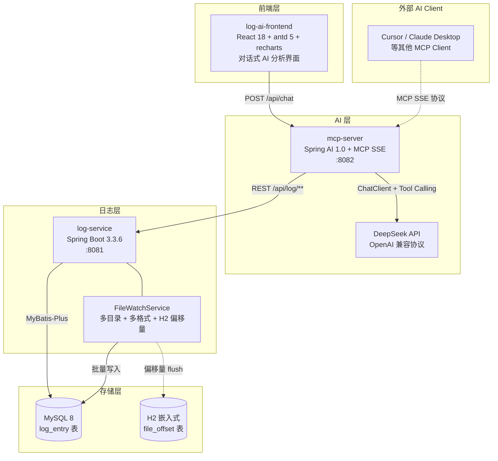
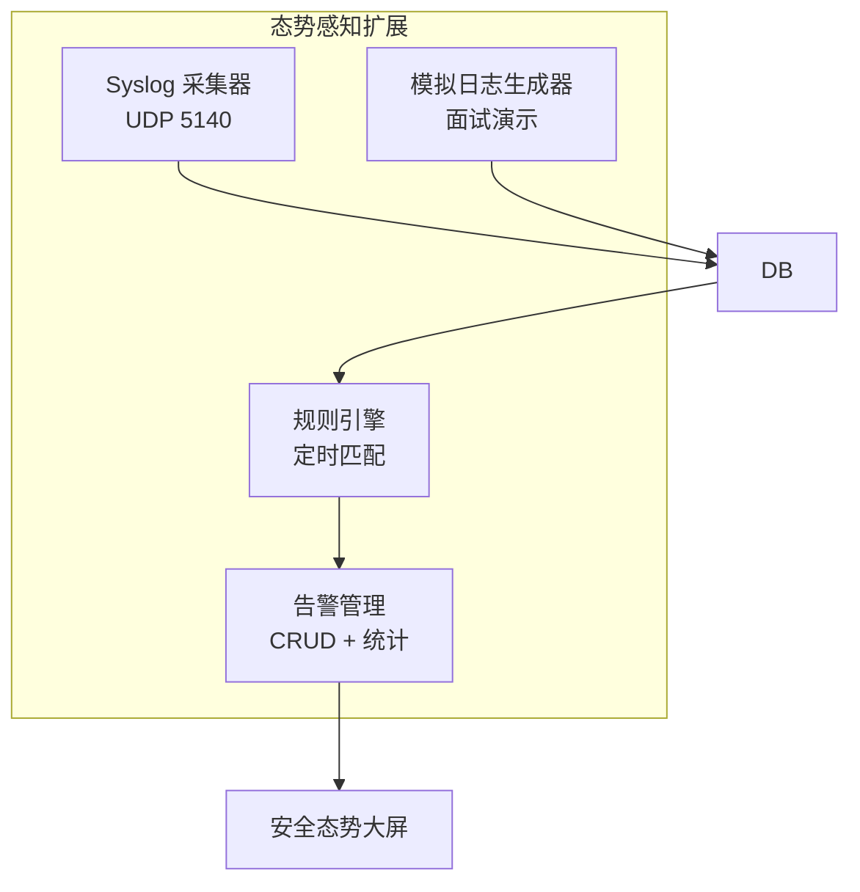

# Log Monitor AI Platform

> **主分支（已合并态势感知增强版）** - 基于 AI 日志分析平台扩展安全态势感知能力

基于 MCP 协议的日志分析 Agent 平台。将日志检索、链路追踪、异常聚类、根因定位封装为 AI 可调用的工具，支持自然语言对话式日志分析。

## 1. 核心能力

- **自然语言查询**：用户用中文/英文描述问题，AI 自动调用合适的工具
- **链路追踪**：从日志内容正则提取 SkyWalking TraceID，按 TraceID 聚合链路日志
- **异常聚类**：按异常类型 + 堆栈首行分组统计，快速识别高频异常
- **根因定位**：基于链路日志识别异常传播路径，定位根本原因
- **MCP 协议**：日志分析能力通过 MCP Server 暴露，其他 AI 应用可作为 MCP Client 接入
- **多源日志**：支持 FILE（文件监控）/ HTTP（接口上报）/ ELK / LOKI / MOCK 多种来源
- **可视化展示**：TraceID 链路时间线、异常聚类柱状图、Markdown 渲染

### 1.1 态势感知增强版说明

log-ai-SA 分支在原 AI 日志分析平台基础上扩展了安全能力，使平台从单纯的日志分析工具升级为面向安全运营的态势感知系统。

**新增能力：**

- **Syslog 采集**：基于 UDP 5140 端口实时接收 Syslog / CEF 格式安全日志
- **规则引擎**：定时（每分钟）扫描日志，按规则匹配触发告警
- **告警管理**：告警 CRUD、状态流转、统计聚合
- **安全异常检测**：AI 安全分析 Tool，识别异常 IP、攻击行为、异常流量
- **态势大屏**：前端"安全态势"tab 可视化大屏，展示告警趋势、威胁分布

**适用场景：**

- 安全运营中心（SOC）
- 网络监控与威胁检测
- 安全事件响应与分析

## 2. 架构

### 2.1 架构图



### 2.2 技术栈

| 层级 | 技术 | 版本 |
|---|---|---|
| 基础框架 | Spring Boot | 3.3.6 |
| AI 框架 | Spring AI | 1.0.0 GA |
| MCP 协议 | spring-ai-starter-mcp-server-webmvc | 1.0.0 |
| 大模型 | DeepSeek（OpenAI 兼容） | deepseek-chat |
| ORM | MyBatis-Plus | 3.5.10 |
| 数据库 | MySQL | 8.x |
| JSON | FastJSON2 | 2.0.43 |
| JDK | OpenJDK | 17+ |
| 构建工具 | Maven | 3.8+ |
| 前端框架 | React + TypeScript | 18 + 5.6 |
| UI 组件 | antd | 5.22 |
| 图表库 | recharts | 2.13 |
| Markdown | react-markdown + remark-gfm | 9 + 4 |
| 前端构建 | Vite | 6.0 |

### 2.3 SA 架构扩展

log-ai-SA 分支在原架构基础上扩展了以下组件：



## 3. 模块说明

| 模块 | 说明 | 端口 |
|---|---|---|
| `common` | 公共实体、枚举、Result、异常处理 | — |
| `log-service` | 日志采集与查询服务（文件监控 + REST API） | 8081 |
| `mcp-server` | MCP Server + ChatClient，暴露 4 个 @Tool | 8082 |
| `log-ai-frontend` | 对话式 AI 分析前端 | 3000 |

### 3.1 common（公共模块）

跨模块共享的数据结构。

| 包 | 内容 |
|---|---|
| `entity` | LogEntry（含 traceId、serviceName、logSource 字段） |
| `enums` | LogLevel、LogSource（FILE/HTTP/ELK/LOKI/MOCK） |
| `dto` | LogEntryDTO |
| `result` | Result&lt;T&gt; 统一返回体 |
| `exception` | BusinessException、GlobalExceptionHandler |

### 3.2 log-service — 端口 8081

日志采集与查询服务。

**核心功能：**
- `FileWatchService` 多目录监听，增量读取日志文件（WatchService + RandomAccessFile）
- 多格式自动适配（5 个 Parser + 兜底）：logback 自定义/默认、log4j2 默认、JSON、纯文本
- 文件首次读取时取前 10 行做格式探测，绑定命中率最高的 Parser
- TraceID 正则提取（兼容 SkyWalking TID、通用 `traceId`、`tid` 格式）
- 服务名推断（文件名去 `.log` 后缀）
- `LogBatchProcessor` 异步批处理，MyBatis-Plus `saveBatch` 批量入库
- 自身日志过滤（防止单部署反馈循环）
- **偏移量持久化**：内存缓存 + H2 嵌入式数据库，每 10 秒 flush，重启不重复采集
- **OOM 防护**：单次 batch 上限 1000 条，单次读取上限 5000 行

**日志格式适配器（parser 包）：**

| Parser | 适配格式 | 示例 |
|---|---|---|
| `JsonLogParser` | logstash-encoder JSON 输出 | `{"@timestamp":"...","level":"INFO","message":"..."}` |
| `LogbackCustomParser` | logback 自定义格式（`-` 分隔） | `2026-07-19 21:33:35.138 INFO [main] c.l.l.App - Starting...` |
| `LogbackDefaultParser` | Spring Boot 默认控制台格式（`:` 分隔） | `2026-07-19 21:33:35.138  INFO [main] c.l.l.App : Starting...` |
| `Log4j2DefaultParser` | log4j2 默认格式（时分秒，无日期） | `21:33:35.138 INFO [main] c.l.l.App - Starting...` |
| `PlainLogParser` | 兜底，所有格式不匹配时使用 | 只提取日志级别，其他字段丢失 |

**REST API：**

| 方法 | 路径 | 说明 |
|---|---|---|
| GET | `/api/log/entries` | 分页查询日志（支持多维度筛选） |
| GET | `/api/log/entries/{id}` | 查询单条日志详情 |
| GET | `/api/log/trace/{traceId}` | 按 TraceID 查询链路日志（按时间升序） |
| POST | `/api/log/collect` | HTTP 模式批量接收日志上报 |

**筛选参数（`/api/log/entries`）：**

| 参数 | 说明 |
|---|---|
| `page` / `size` | 分页，默认 1 / 20 |
| `logLevel` | TRACE/DEBUG/INFO/WARN/ERROR/FATAL |
| `className` / `fileName` / `threadName` | 模糊匹配 |
| `startTime` / `endTime` | ISO DateTime 时间范围 |
| `keyword` | 关键字（同时匹配内容、类名、文件名） |
| `traceId` / `serviceName` / `logSource` | 链路维度筛选 |

**配置项（`application.yml`）：**

| 配置项 | 默认值 | 说明 |
|---|---|---|
| `log.watch.directories` | — | 日志监控目录（逗号分隔，支持多目录） |
| `log.watch.poll-interval-ms` | 500 | 轮询间隔（ms） |
| `log.watch.filter-self-logs` | true | 过滤自身组件日志 |
| `log.watch.self-log-classes` | LogBatchProcessor,FileWatchService | 自身组件类名（逗号分隔） |

**偏移量持久化（H2 嵌入式）：**

启动后自动在项目根目录创建 `data/log-offset.*` 文件（H2 数据库），存储 `file_offset(file_path PK, offset, updated_at)` 表。进程重启时从 H2 恢复偏移量，避免重复采集。H2 DataSource 独立于主 MySQL DataSource，配置在 `OffsetDataSourceConfig` 中。

### 3.3 mcp-server — 端口 8082

MCP Server + ChatClient，将日志分析能力暴露为 AI 可调用工具。

**核心能力：**
- `spring-ai-starter-mcp-server-webmvc` 提供 MCP SSE 协议端点（`/sse` + `/mcp`）
- `spring-ai-starter-model-openai` 接入 DeepSeek（兼容 OpenAI 协议）
- `@Tool` 注解自动注册工具方法，`MethodToolCallbackProvider` 统一注入 ChatClient
- `LogServiceClient` 通过 RestClient 调用 log-service REST API

**4 个 MCP Tool：**

| 工具名 | 说明 | 关键参数 |
|---|---|---|
| `searchLogs` | 搜索日志，支持多维度筛选 | logLevel、keyword、serviceName、page、size |
| `getTraceLogs` | 按 TraceID 查询链路日志 | traceId |
| `clusterExceptions` | 异常聚类分析（异常类名 + at 行去行号作聚类 key） | logLevel（默认 ERROR）、size |
| `locateRootCause` | 根因定位（识别 ERROR 日志 + 完整链路时间线） | traceId |

**工具返回值协议：**

工具返回人类可读文本 + ` ```tool:kind\n{json}\n``` ` 结构化块，前端解析 JSON 后渲染为可视化组件。

| kind | 前端渲染 |
|---|---|
| `search` | Markdown 文本（预留可视化） |
| `trace` | TraceTimeline 时间线 |
| `cluster` | ClusterChart 柱状图 |
| `rootCause` | TraceTimeline 时间线（高亮 ERROR） |

**REST API：**

| 方法 | 路径 | 说明 |
|---|---|---|
| POST | `/api/chat` | 同步对话接口，请求体 `{message: string}`，响应 `{response: string}` |
| GET | `/sse` | MCP SSE 端点（MCP Client 连接） |

**配置项（`application.yml`）：**

```yaml
spring:
  ai:
    mcp:
      server:
        name: log-analysis-mcp-server
        version: 2.0.0
        type: SYNC
        protocol: SSE
        annotation-scanner:
          enabled: true
    openai:
      api-key: ${DEEPSEEK_API_KEY:sk-placeholder}    # 通过环境变量注入
      base-url: https://api.deepseek.com
      chat:
        options:
          model: deepseek-chat
          temperature: 0.7
log-service:
  url: http://localhost:8081
```

> **API Key 注入**：通过环境变量 `DEEPSEEK_API_KEY` 注入，配置文件中仅为占位符。本地运行时可在 IDEA 启动配置或 shell 中设置：
> - PowerShell：`$env:DEEPSEEK_API_KEY="sk-your-real-key"`
> - Linux/Mac：`export DEEPSEEK_API_KEY=sk-your-real-key`

### 3.4 log-ai-frontend — 端口 3000

对话式 AI 分析前端。

**核心功能：**
- 对话主界面（消息历史 + 输入框，Enter 发送 / Shift+Enter 换行）
- 4 个快捷查询按钮（查 ERROR 日志 / 异常聚类 / 按 TraceID 查链路 / 根因定位）
- Markdown 渲染（react-markdown + remark-gfm，支持表格、代码块）
- TraceTimeline 组件：链路日志按时间线展示，按级别染色
- ClusterChart 组件：异常聚类横向柱状图（recharts）+ 详情列表
- 暗色/浅色主题切换（antd darkAlgorithm + CSS 变量 + localStorage 持久化）
- Vite dev 代理 `/api` → mcp-server:8082

**项目结构：**

```
log-ai-frontend/src/
├── api/chat.ts              # 对话 API 客户端
├── hooks/useTheme.ts        # 主题切换 hook
├── types/index.ts           # 类型定义
├── components/
│   ├── ChatWindow.tsx       # 对话主窗口
│   ├── MessageItem.tsx      # 单条消息渲染（含工具块解析）
│   ├── InputBox.tsx         # 输入框 + 发送/清空按钮
│   ├── QuickActions.tsx     # 快捷查询按钮组
│   ├── ThemeToggle.tsx      # 主题切换按钮
│   ├── TraceTimeline.tsx    # 链路时间线可视化
│   └── ClusterChart.tsx     # 异常聚类柱状图
├── App.tsx                  # 顶部标题栏 + 主题切换 + 对话主区
├── main.tsx                 # 入口 + ConfigProvider（暗色/浅色 algorithm）
└── index.css                # CSS 变量（浅色/暗色双主题）
```

### 3.5 态势感知扩展模块

log-ai-SA 分支新增的安全相关组件：

| 组件 | 所在模块 | 说明 |
|---|---|---|
| `SyslogParser` / `CEFParser` | log-service parser 包 | 安全日志格式解析（标准 Syslog 与 CEF） |
| `SyslogServerService` | log-service | UDP Syslog 采集器，监听 5140 端口 |
| `RuleEngineService` | log-service | 规则引擎，每分钟定时扫描日志匹配规则 |
| `RuleService` / `AlertService` | log-service | 规则与告警管理（CRUD + 统计） |
| `SecurityLogSimulator` | log-service | 模拟安全日志生成器（面试演示用） |
| `detectAnomalies` / `correlateEvents` | mcp-server tool | AI 安全分析 Tool，异常检测与事件关联 |

## 4. 数据库

### 4.1 log_entry 表

| 字段 | 类型 | 说明 |
|---|---|---|
| `id` | BIGINT PK | 主键 |
| `file_name` | VARCHAR | 日志文件名 |
| `file_path` | VARCHAR | 文件完整路径 |
| `log_level` | VARCHAR | 日志级别 |
| `log_time` | DATETIME | 日志时间 |
| `thread_name` | VARCHAR | 线程名 |
| `class_name` | VARCHAR | 类名 |
| `content` | TEXT | 日志内容 |
| `trace_id` | VARCHAR | 链路追踪 TraceID（正则提取） |
| `service_name` | VARCHAR | 来源服务名（文件名推断） |
| `log_source` | VARCHAR | 日志来源类型（FILE/HTTP/ELK/LOKI/MOCK） |
| `create_time` / `update_time` | DATETIME | 审计字段 |

**索引：** `idx_log_time`、`idx_log_level`、`idx_trace_id`、`idx_service_name`、`idx_log_source`、`idx_service_level_time`（复合）、`idx_level_time`（复合）

> 复合索引脚本：[.docs/log_entry_indexes.sql](file:///d:/zyjk/log-ai/.docs/log_entry_indexes.sql)，需在 MySQL 中手动执行

### 4.2 初始化

```bash
mysql -u root -p < .docs/logs.sql
```

`.docs/logs.sql` 内置 5 个场景的 Mock 测试数据（trace-001/002/003 链路，含 NPE、超时、OOM、DB 连接失败异常），可直接体验对话分析。

### 4.3 SA 扩展表

log-ai-SA 分支在原 `log_entry` 表基础上扩展了安全字段，并新增 `rule`、`alert` 两张表。

**log_entry 新增安全字段：**

| 字段 | 类型 | 说明 |
|---|---|---|
| `src_ip` | VARCHAR | 源 IP |
| `dst_ip` | VARCHAR | 目标 IP |
| `src_port` | INT | 源端口 |
| `dst_port` | INT | 目标端口 |
| `protocol` | VARCHAR | 协议（TCP / UDP / ICMP / HTTP 等） |
| `action` | VARCHAR | 动作（ALLOW / DENY / REJECT 等） |
| `severity` | VARCHAR | 威胁等级（INFO / WARN / CRITICAL 等） |

**rule 表（规则定义）：**

| 字段 | 类型 | 说明 |
|---|---|---|
| `id` | BIGINT PK | 主键 |
| `name` | VARCHAR | 规则名称 |
| `description` | VARCHAR | 规则描述 |
| `pattern` | TEXT | 匹配表达式（关键字 / 正则） |
| `severity` | VARCHAR | 命中后告警等级 |
| `enabled` | TINYINT | 是否启用（0 / 1） |
| `create_time` / `update_time` | DATETIME | 审计字段 |

**alert 表（告警记录）：**

| 字段 | 类型 | 说明 |
|---|---|---|
| `id` | BIGINT PK | 主键 |
| `rule_id` | BIGINT | 关联规则 ID |
| `log_entry_id` | BIGINT | 命中的日志 ID |
| `content` | TEXT | 告警内容 |
| `severity` | VARCHAR | 告警等级 |
| `status` | VARCHAR | 告警状态（PENDING / RESOLVED / IGNORED） |
| `create_time` / `update_time` | DATETIME | 审计字段 |

> 建表脚本：[.docs/sa_schema.sql](file:///d:/zyjk/log-ai/.docs/sa_schema.sql)，需在 MySQL 中手动执行

## 5. 部署

### 5.1 环境要求

- JDK 17+
- Maven 3.8+
- MySQL 8+
- Node.js 18+（前端构建）
- DeepSeek API Key（[申请地址](https://platform.deepseek.com/)）

### 5.2 启动顺序

**1. 初始化数据库**

```bash
mysql -u root -p -e "CREATE DATABASE log_monitor DEFAULT CHARSET utf8mb4;"
mysql -u root -p log_monitor < .docs/logs.sql
```

**2. 启动 log-service（:8081）**

```bash
# 修改 log-service/src/main/resources/application.yml 中的数据源 + log.watch.directories
# directories 支持逗号分隔多目录，如：D:/zyjk/testlog,D:/my-project/logs
mvn spring-boot:run -pl log-service
```

**3. 启动 mcp-server（:8082）**

```bash
# 设置 DeepSeek API Key（必须，否则工具调用无法触发 LLM）
# Windows PowerShell
$env:DEEPSEEK_API_KEY="sk-your-real-key"
# Linux/Mac
export DEEPSEEK_API_KEY=sk-your-real-key

mvn spring-boot:run -pl mcp-server
```

**4. 启动前端（:3000）**

```bash
cd log-ai-frontend
npm install
npm run dev
```

**5. 访问**

- 对话界面：http://localhost:3000
- log-service API：http://localhost:8081
- mcp-server MCP SSE 端点：http://localhost:8082/sse

### 5.3 生产打包

```bash
# 后端
mvn clean package -DskipTests
# 各模块 target/*.jar 独立部署

# 前端
cd log-ai-frontend
npm run build
# dist/ 静态资源，可部署到 nginx 或拷贝到 mcp-server/src/main/resources/static
```

### 5.4 MCP Client 接入（Cursor / Claude Desktop 等）

mcp-server 同时作为独立 MCP Server 暴露给其他 AI 应用使用。在 MCP Client 配置文件中添加：

```json
{
  "mcpServers": {
    "log-analysis": {
      "url": "http://localhost:8082/sse"
    }
  }
}
```

接入后，AI 应用可通过自然语言调用 4 个日志分析工具。

### 5.5 SA 模式启动

log-ai-SA 分支在原有启动流程基础上，增加以下步骤启用态势感知能力：

**1. 执行 SA 扩展脚本**

```bash
mysql -u root -p log_monitor < .docs/sa_schema.sql
```

脚本会扩展 `log_entry` 表（新增安全字段）并创建 `rule`、`alert` 两张表。

**2. 开启 Syslog 采集（可选）**

在 `log-service/src/main/resources/application.yml` 中：

```yaml
log:
  syslog:
    enabled: true        # 开启 UDP 5140 Syslog 采集
```

**3. 开启模拟数据（演示用，可选）**

```yaml
log:
  simulator:
    enabled: true        # 启动后自动生成模拟安全日志
```

> 面试 / 演示场景建议开启 `simulator.enabled`，可快速产生模拟攻击日志用于规则匹配与告警展示。

**4. 启动后访问**

- 前端"安全态势"tab 查看态势大屏
- 在 AI 对话中触发安全分析 Tool：
  - "检测最近异常" — 调用 `detectAnomalies` 工具
  - "分析攻击源 IP" — 调用 `correlateEvents` 工具

## 6. 使用示例

### 6.1 对话式查询

打开 http://localhost:3000，直接输入：

- "帮我搜索最近的 ERROR 级别日志"
- "查询 traceId=trace-001 的链路日志"
- "对最近的异常日志做聚类分析，按异常类型分组统计"
- "根据 traceId=trace-001 做根因定位分析"
- "order-service 服务最近有什么异常？"

### 6.2 快捷查询

界面底部 4 个快捷按钮：
- **查 ERROR 日志**：一键搜索最近 ERROR 级别日志
- **异常聚类**：一键触发异常聚类分析
- **按 TraceID 查链路**：查询 trace-001 的链路日志（Mock 数据）
- **根因定位**：根据 trace-001 做根因分析（Mock 数据）

### 6.3 TraceID 格式兼容

FileWatchService 自动从日志内容中提取以下格式的 TraceID：
- `traceId: abc123def456`
- `trace-id: abc123def456`
- `tid:abc123def456`（SkyWalking 格式）
- `[traceId=abc123def456]`
- `(tid: abc123def456)`

提取的正则：

```
(?:trace[_-]?id|tid)[:\s]*[\[\(]?([a-zA-Z0-9.\-]{8,64})[\]\)]?
```

## 7. 项目结构

```
log-ai/
├── pom.xml                              # 父 POM（Spring Boot 3.3.6 + Spring AI 1.0 BOM）
├── .docs/logs.sql                       # 数据库初始化脚本 + Mock 数据
├── common/                              # 公共模块（Entity/Enum/Result/Exception）
├── log-service/                         # 日志采集服务（文件监控 + REST API）
│   └── src/main/java/com/logmonitor/log/
│       ├── config/                      # AsyncConfig、FileWatchConfig、MybatisPlusConfig、OffsetDataSourceConfig
│       ├── controller/                  # LogCollectController、LogEntryController
│       ├── parser/                      # LogParser 接口 + 5 个适配器 + LogParserRegistry
│       ├── service/impl/                # FileWatchService、LogBatchProcessor、LogEntryServiceImpl
│       ├── store/                       # FileOffsetStore 接口 + H2FileOffsetStore 实现
│       └── mapper/                      # LogEntryMapper
├── mcp-server/                          # MCP Server + ChatClient
│   └── src/main/java/com/logmonitor/mcp/
│       ├── client/                      # LogServiceClient（RestClient 调用 log-service）
│       ├── config/                      # ChatClientConfig（ToolCallbackProvider + ChatClient）
│       ├── controller/                  # ChatController（POST /api/chat）
│       └── tool/                        # LogAnalysisTools（4 个 @Tool 方法）
├── log-ai-frontend/                     # 对话式 AI 分析前端
│   └── src/
│       ├── api/                         # chat.ts
│       ├── components/                  # 8 个 React 组件
│       ├── hooks/                       # useTheme
│       └── types/                       # 类型定义
└── README.md
```

## 8. 扩展

- **替换大模型**：修改 `mcp-server/application.yml` 的 `spring.ai.openai` 配置，可切换 OpenAI、Qwen、通义千问、本地 Ollama 等
- **新增 MCP Tool**：在 `LogAnalysisTools` 中添加 `@Tool` 方法，自动注册到 MCP Server 和 ChatClient
- **新增日志来源**：扩展 `LogSource` 枚举，在对应采集器中设置 `logSource` 字段
- **流式输出**：`ChatController` 可改为 `SseEmitter` + `ChatClient.stream()`，前端 `streamMessage` 接口已预留
- **多租户**：`log_entry` 增加租户字段，工具方法注入租户上下文

## 9. Git 工作流

| 分支/Tag | 说明 |
|---|---|
| `master` | 主分支，最新稳定版本 |
| `log-ai-1.0.1` | v1.0 最初版本（Spring Boot 3.2 + 微服务架构） |
| `log-ai-2.0` | v2.0 开发分支（MCP + Spring AI 改造） |
| `v1.0.0` | v1.0 基线 tag，标记在 log-ai-1.0.1 末尾 |

---
*文档更新：2026-07-19 · v3.0 SA · 态势感知增强版*
